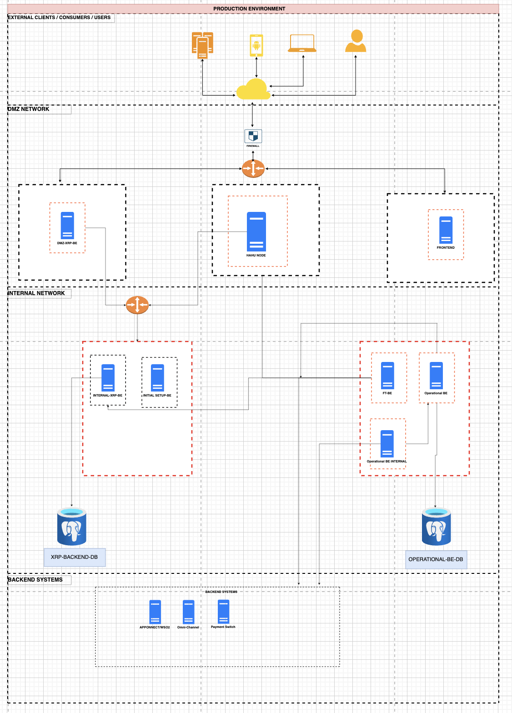

Architecture Details
The system consists of multiple layers and components, each responsible for a specific set of tasks.

1. External Clients/Users
   External users, such as consumers and business clients, interact with the system using web or mobile interfaces. These interactions are routed through a secure cloud network to the DMZ Network.

2. DMZ Network
   The DMZ-APP-GE proxy server acts as a gateway between the external environment and the internal network. It forwards legitimate requests to the Main Node for processing while blocking unauthorized access.

3. Internal Network
   Main Node: This is the central processing unit for the XRP Offer Creation System. It handles core operations like:
   Offer Creation: Processes incoming requests to create XRP offers.
   Issuer Account Monitoring: Monitors issuer accounts for any changes, allowing the system to react to issuer-driven events.
   Internal-APP-GE: Handles the initialization and configuration of internal applications. It also facilitates communication between various internal services.
4. Operational Backend
   PT-BE (Processing & Transaction Backend): Manages the flow of offer creation requests and ensures that transactions related to XRP offers are processed efficiently.
   Operational-BE: This component listens to issuer accounts for activities such as new offer requests or cancellations and updates the system accordingly.
5. Databases
   XRP-BACKEND-DB: Stores all relevant data regarding XRP offers, including their creation, status, and transaction history.
   OPERATIONAL-BE-DB: Houses operational data related to backend system activity, such as issuer account changes and internal monitoring logs.
6. Backend Systems Integration
   The system integrates with several external services for additional functionalities:

APIGateway: Manages API interactions between the XRP Offer Creation System and external payment systems.
OneChannel: Ensures smooth communication with other external services.
Payment Switch: Facilitates secure and real-time payment processing for XRP offers.

